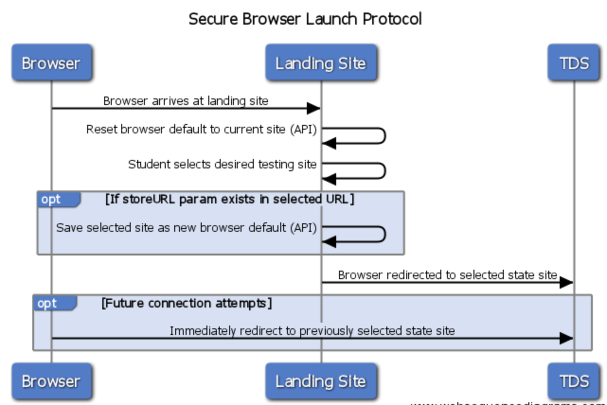
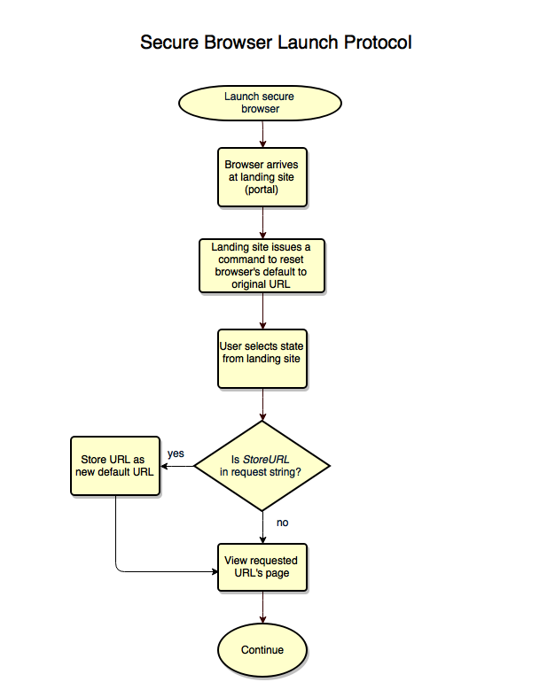

# Secure Browser Launch Protocol Specification
v.1.10 - Last modified 30-Apr-2017

## IP Notice
This specification is &copy;2017 by The Regents of the University of California, Smarter Balanced Assessment Consortium and is licensed under a [Creative Commons Attribution 4.0 International License](https://creativecommons.org/licenses/by/4.0/).

## Overview
In order to provide a seamless launch experience for the student, as well as centrally-managed experience for states, the Secure Browser follows a simple launch protocol described herein.

The launch protocol is implemented using a hosted webpage ("portal" or "landing" page) with a prescribed list of testing hosts. The host of the landing page would be the gatekeeper to other uses of the browser, and be responsible for managing link updates, load, and user experience for that page. 
 
Once the student selects a test site, the browser is redirected to that site and optionally stores that selection. If stored, future launches of the browser will apply the selection (if any) and immediately direct to the selected testing site.

### Benefits
* URLs can be updated in real time in a single location
* Landing site can be scaled to handle necessary load when needed
* Login process only executed once per student

## Specification
The sequence diagram below (Figure 1) should be used as a guideline for the normal launch interactions among the secure browser, landing site, and the test delivery system (TDS).

1. The Secure Browser arrives at the (preconfigured) landing site URL upon initial launch (or, arrives at the landing site as a result of a redirect from the student login page).
1. The landing site issues an API command to reset the browser's default URL to the original default landing site's, essentially clearing the previously-stored URL (if any).
1. The user/student selects an appropriate testing site (e.g. California Summative).
1. The browser is redirected to the selected state site (and stores the URL as the new default if the StoreURL option is provided for that URL).
1. Future connection attempts will have the Secure Browser immediately redirect to the previously selected testing site, if that option was selected.
1. TDS provides a mechanism for the student to browse back to the landing site in case the selection needs to be changed.

Figure 1: Secure Browser Launch Protocol Sequence Diagram

### Example URLs

* Default (landing page) URL: http://browser.smarterbalanced.org/landing
* https://aa.tds.airast.org/student  (will redirect and not store)
* https://aa.tds.airast.org/student?StoreURL=true   (will redirect and store)
* https://aa.tds.airast.org/student?ResetURL=true   (will reset default URL to original default landing page but redirect to requested URL)
* https://aa.tds.airast.org/student?StoreURL=true&ResetURL=true   (will default URL to original default landing page, but redirect to requested URL. The StoreURL option is ignored.)

### Flow Chart
The flow chart (Figure 2) and design description below (Figure 3) include details of all possible launch protocol conditions and options. 



Figure 2: Launch Protocol flow chart


```
IF the ResetURL option is set
   set the URL to the original (hardcoded) default URL
ELSE
   IF the storeURL option is set
      make this URL the new default URL
   ENDIF
ENDIF
```
Figure 3: Launch Protocol design description

### Recommended Implementation

The recommended implementation of this protocol is as follows:

1. The landing page (portal) provides URLs from which the user/student can choose. The URLs optionally contain the StoreURL or ResetURL options.
1. The landing page resets the browser's default to the original default page.
1. Upon selection of a target state/URL, or after pressing a confirmation button, the landing page calls appropriate API to set the URL as the new browser default (if URL option exists in URL query string). 
1. If necessary, the browser receives this API call and implements the request.
1. Browser is redirected to the requested URL.

### API

1. A1. **Store URL**
 
     This API will set a given URL as a default URL which will be used by the Secure Browser to redirect upon its next launch.
 
     `void SecureBrowser.security.setAltStartPage(String urlString, String identifier, function callback)`

    * `urlString` : URL to set as default URL (required)
    * `identifier` : optional string
    * `callback` : optional . If used, it should be of the form 
        * `function(success){ }`
        * `success : true/false`
     
 
1. A2. **Reset URL**
 
     This API will reset the default URL back to the default landing page.
 
     `void SecureBrowser.security.restoreDefaultStartPage()`
 
 
## References
1. [Secure Browser Functional Requirements](https://github.com/SmarterApp/SB_BIRT/blob/master/irp/doc/req/SecureBrowserFunctionalRequirements.md)
1. [Secure Browser API Specification](https://github.com/SmarterApp/SB_BIRT/blob/master/irp/doc/req/SecureBrowserAPIspecification.md)
